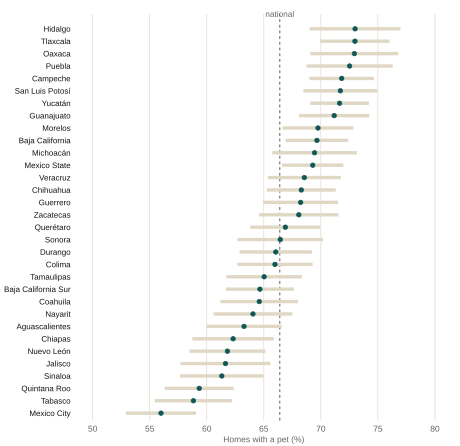
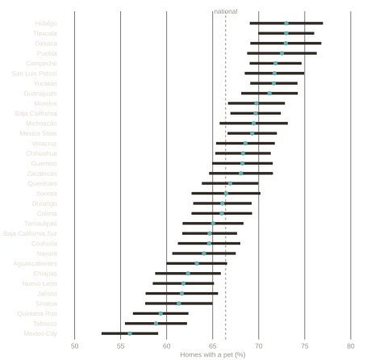
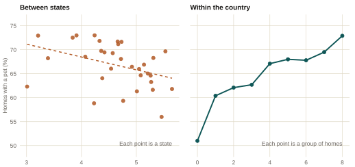
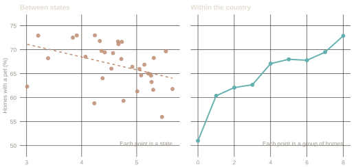

::: {.eyebrow}
Curiosity · INEGI, ENBIARE 2025 · Public microdata
:::

Statistics has an old mistake with a name. It shows up when a relationship is
measured between groups and then read as if it also held for the individuals
inside those groups. The two are different quantities. They can differ by a
lot, and they can point in opposite directions.

The example that named the mistake is from 1950. Looking at the 1930 US
census, the sociologist W. S. Robinson found that states with more foreign-born
residents had less illiteracy, a correlation of −0.53 across states. Among
individuals the relationship ran the other way: a foreign-born person was more
likely to be illiterate, a correlation of +0.12. Both numbers are right. They
answer different questions, and only the second one is about people. Robinson
called the first an ecological correlation, and treating it as if it were the
second became known as the **ecological fallacy**.

The trap is easy to describe and hard to see in the wild, because aggregated
data never announces that it is aggregated. Mexico now has an unusually clean
example, and it is about pets.

## What INEGI published

In July 2026 INEGI released the microdata of its 2025 wellbeing survey. For
the first time it counts pets: 66.4% of homes have at least one, and the
survey expands to 41.2 million dogs and 19.2 million cats. The headline
travelled, and so did a ranking of states.

## Where the pets are

Pets are not spread evenly. Hidalgo, Tlaxcala, Oaxaca and Puebla sit near 73%
of homes. Mexico City closes the list at 56%.

```{ojs}
//| echo: false
//| output: false
pets = FileAttachment("../../data/pets-estados.csv").csv({ typed: true })
mx = FileAttachment("../../data/mx-estados.json").json()

// Same state-code map the Labor Market MX pages use. The topojson keys are
// state codes as strings, so both sides of the join are coerced to numbers
// before lookup (see the id-format bug noted in CLAUDE.md section 13).
entidadPorCodigo = ({
  "1": "Aguascalientes", "2": "Baja California", "3": "Baja California Sur",
  "4": "Campeche", "5": "Coahuila", "6": "Colima", "7": "Chiapas",
  "8": "Chihuahua", "9": "Mexico City", "10": "Durango", "11": "Guanajuato",
  "12": "Guerrero", "13": "Hidalgo", "14": "Jalisco", "15": "Mexico State",
  "16": "Michoacán", "17": "Morelos", "18": "Nayarit",
  "19": "Nuevo León", "20": "Oaxaca", "21": "Puebla", "22": "Querétaro",
  "23": "Quintana Roo", "24": "San Luis Potosí", "25": "Sinaloa", "26": "Sonora",
  "27": "Tabasco", "28": "Tamaulipas", "29": "Tlaxcala",
  "30": "Veracruz", "31": "Yucatán", "32": "Zacatecas"
})

// Una rampa por medida, para que al cambiar el selector el mapa se vea
// distinto de inmediato y no solo cambie de tonos. Cada una es de un solo
// tono, claro a oscuro, como pide una escala secuencial: verde azulado para
// el total (el extremo oscuro cae cerca del $teal del sitio), naranja rojizo
// para perro (la familia del $ochre, y lo que ya usan los mapas de Mercado
// Laboral MX) y morado para gato, que es el tercer tono que el sitio ya usa
// en la rampa de edad. Tres tonos bien separados en el circulo cromatico.
medidas = ({
  mascota: { nombre: "Any pet", etiqueta: "Homes with a pet (%)", esquema: "BuGn" },
  perro:   { nombre: "Dog", etiqueta: "Homes with a dog (%)", esquema: "OrRd" },
  gato:    { nombre: "Cat", etiqueta: "Homes with a cat (%)", esquema: "Purples" }
})

mxFeatures = topojson.feature(mx, mx.objects.state).features

graficaMapa = (filas, etiqueta, esquema, { width = 640, height = 430 } = {}) => {
  const porCodigo = new Map(filas.map(d => [d.cve_ent, d]));
  const features = mxFeatures.map(f => {
    const fila = porCodigo.get(+f.properties.id);
    return {
      ...f,
      nombre: entidadPorCodigo[+f.properties.id],
      valor: fila ? fila.valor : undefined,
      ee: fila ? fila.ee : undefined
    };
  });
  return Plot.plot({
    width, height,
    style: { background: "transparent", fontFamily: "IBM Plex Sans, sans-serif", fontSize: "12px", color: "var(--ink)" },
    projection: { type: "mercator", domain: { type: "FeatureCollection", features } },
    color: { type: "linear", scheme: esquema, label: etiqueta, legend: true },
    marks: [
      Plot.geo(features, {
        fill: d => d.valor,
        stroke: "var(--ink)", strokeWidth: 1,
        tip: true,
        title: d => `${d.nombre}\n${etiqueta}: ${d.valor.toFixed(1)} ± ${(1.96 * d.ee).toFixed(1)}`
      })
    ]
  });
}
```

```{ojs}
//| echo: false
viewof medida_sel = Inputs.select(Object.keys(medidas), {
  value: "mascota",
  label: "Pet",
  format: d => medidas[d].nombre
})
```

```{ojs}
//| echo: false
//| output: false
filasMapa = pets.map(d => ({ cve_ent: d.cve_ent, valor: d[medida_sel], ee: d[medida_sel + "_ee"] }))
etiquetaMapa = medidas[medida_sel].etiqueta
esquemaMapa = medidas[medida_sel].esquema
```

::: {.data-panel}

```{ojs}
//| echo: false
graficaMapa(filasMapa, etiquetaMapa, esquemaMapa)
```

:::

## The state ranking is mostly sampling noise

Each state is estimated from about a thousand homes. The median standard error
is 1.7 points, so a 95% confidence interval runs 3.3 points either side of the
estimate and is 6.6 points wide. The distance between Tlaxcala and Puebla is
0.47 of a point. It fits fourteen times inside that interval.

::: {.chart-figure}
{.chart-img-light}
{.chart-img-dark}

Share of homes with at least one pet, by state, with 95% confidence intervals
from the survey design. The dashed line is the national estimate, 66.4%.
:::

Most of the intervals overlap. Ordering 32 states from first to last reads
sampling noise as a result. What does survive is the contrast between the
extremes: Mexico City is genuinely below the rest of the country.

## The same relationship at two levels of aggregation

The survey asks about eight household assets in the same section as the pets:
refrigerator, washing machine, car, flat screen, computer, game console,
internet, and a paid streaming service. Counting them gives a rough index of
material standard of living, from 0 to 8. Crossing that index with pet
ownership gives two answers, depending on what counts as an observation.

::: {.chart-figure}
{.chart-img-light}
{.chart-img-dark}

Left: the 32 states, average assets against the share of homes with a pet. The
correlation is −0.39. Right: homes grouped by how many of the eight assets they
own. Both panels share the vertical axis.
:::

Between states the relationship is negative. Within the country it is positive
and close to monotone, rising 21.9 points from homes with no assets to homes
with all eight. Both panels describe the same 32,908 homes.

That is Robinson's reversal, with pets in place of literacy. The left panel is
a fact about states and it is correctly measured. It is simply not a fact about
households, and nothing in it warns that the household version runs the other
way.

## What produces the reversal

Composition. The states with the most pets are the most rural, and rural pulls
in both directions at once: lower assets and more dogs. In localities under
10,000 inhabitants, 71.4% of homes have a pet, against 64.0% elsewhere, and
there are 1.28 dogs per home against 0.95.

Once state fixed effects, locality size and household size are held constant,
each additional asset is associated with a 2.8 point higher probability of
having a pet (standard error 0.19) and 2.7 points for a dog (0.20). For cats
the coefficient is 0.17 points (0.17), which is indistinguishable from zero.
These are conditional correlations from a cross-section, not effects.

## Where else this shows up

The same trap is available wherever data arrive already grouped. A comparison
of countries read as a statement about people. A state map of poverty next to a
state map of anything else. Any regression whose unit is a region when the
claim is about individuals. The question that catches it is short: what is one
row of this table? If the answer is a state and the claim is about households,
the two do not have to agree.

Robinson, W. S. (1950). Ecological Correlations and the Behavior of
Individuals. *American Sociological Review* 15(3), 351–357.

<details class="abstract">
<summary>How this is built</summary>

Source: INEGI, Encuesta Nacional de Bienestar Autorreportado 2025, open
microdata, housing table. Pets are questions P1.8.1.1 through P1.8.3.2, six
items inside the housing section. The survey covers 32,908 homes and expands to
38.9 million, with estimates representative nationally, by state, and by
locality size.

All estimates use the survey's declared design (primary sampling units,
strata and expansion factors) through R's `survey` package, the same standard
the Labor Market MX pages apply to the ENOE. The national figures reproduce
INEGI's own release exactly. The script that downloads the microdata, computes
every number on this page and draws both figures is
[`scripts/08-curiosities-pets.R`](https://github.com/alainpin/alainpineda/blob/main/scripts/08-curiosities-pets.R)
in this site's public repository.

The survey records whether the home has a dog, a cat, or another pet, and how
many of each. It does not record what the other pet is, nor spending,
veterinary care, sterilisation, or breed, and it does not go below the state
and locality-size level.

</details>
