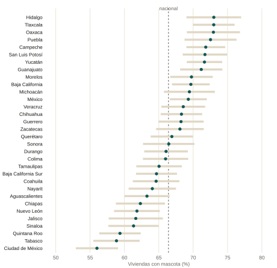
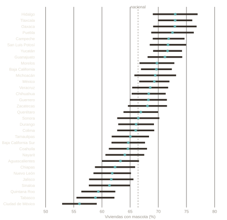
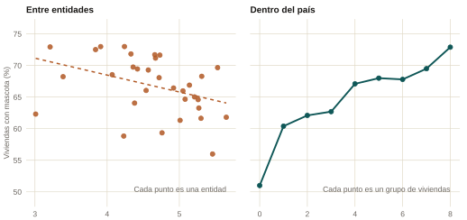
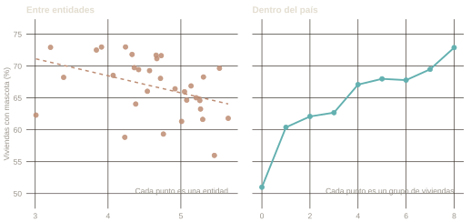

::: {.eyebrow}
Curiosidad · INEGI, ENBIARE 2025 · Microdatos públicos
:::

La estadística tiene un error viejo y con nombre. Aparece cuando una relación
se mide entre grupos y luego se lee como si también valiera para los
individuos que están dentro de esos grupos. Son dos cantidades distintas.
Pueden diferir mucho, y pueden apuntar en direcciones opuestas.

El ejemplo que le dio nombre es de 1950. Revisando el censo estadounidense de
1930, el sociólogo W. S. Robinson encontró que los estados con más residentes
nacidos en el extranjero tenían menos analfabetismo, con una correlación de
−0.53 entre estados. Entre individuos la relación corría al revés: una persona
nacida en el extranjero era más propensa a ser analfabeta, con una correlación
de +0.12. Las dos cifras son correctas. Responden preguntas distintas, y solo
la segunda es sobre personas. Robinson llamó correlación ecológica a la
primera, y tratarla como si fuera la segunda se conoce desde entonces como
**falacia ecológica**.

La trampa es fácil de describir y difícil de ver en el mundo real, porque un
dato agregado nunca avisa que está agregado. México ya tiene un ejemplo
insólitamente limpio, y es de mascotas.

## Qué publicó el INEGI

En julio de 2026 el INEGI publicó los microdatos de su encuesta de bienestar
2025. Por primera vez cuenta mascotas: 66.4% de las viviendas tiene al menos
una, y la encuesta expande a 41.2 millones de perros y 19.2 millones de gatos.
La cifra circuló, y con ella un orden de las entidades.

## Dónde están las mascotas

Las mascotas no se reparten parejo. Hidalgo, Tlaxcala, Oaxaca y Puebla rondan
el 73% de las viviendas. La Ciudad de México cierra la lista con 56%. La
primera lectura de ese mapa es que una mascota es un lujo y que el mapa
debería verse al revés.

```{ojs}
//| echo: false
//| output: false
pets = FileAttachment("../../../data/pets-estados.csv").csv({ typed: true })
mx = FileAttachment("../../../data/mx-estados.json").json()

// El mismo mapa de claves que usan las páginas de Mercado Laboral MX. Las
// claves del topojson son cadenas, así que los dos lados de la unión se
// convierten a número antes de buscar (ver el bug de formato de clave en la
// sección 13 del CLAUDE.md).
entidadPorCodigo = ({
  "1": "Aguascalientes", "2": "Baja California", "3": "Baja California Sur",
  "4": "Campeche", "5": "Coahuila", "6": "Colima", "7": "Chiapas",
  "8": "Chihuahua", "9": "Ciudad de México", "10": "Durango", "11": "Guanajuato",
  "12": "Guerrero", "13": "Hidalgo", "14": "Jalisco", "15": "México",
  "16": "Michoacán", "17": "Morelos", "18": "Nayarit",
  "19": "Nuevo León", "20": "Oaxaca", "21": "Puebla", "22": "Querétaro",
  "23": "Quintana Roo", "24": "San Luis Potosí", "25": "Sinaloa", "26": "Sonora",
  "27": "Tabasco", "28": "Tamaulipas", "29": "Tlaxcala",
  "30": "Veracruz", "31": "Yucatán", "32": "Zacatecas"
})

medidas = ({
  mascota: { nombre: "Cualquier mascota", etiqueta: "Viviendas con mascota (%)" },
  perro:   { nombre: "Perro", etiqueta: "Viviendas con perro (%)" },
  gato:    { nombre: "Gato", etiqueta: "Viviendas con gato (%)" }
})

mxFeatures = topojson.feature(mx, mx.objects.state).features

graficaMapa = (filas, etiqueta, { width = 640, height = 430 } = {}) => {
  const porCodigo = new Map(filas.map(d => [d.cve_ent, d]));
  const features = mxFeatures.map(f => {
    const fila = porCodigo.get(+f.properties.id);
    return {
      ...f,
      nombre: entidadPorCodigo[+f.properties.id],
      valor: fila ? fila.valor : undefined,
      ee: fila ? fila.ee : undefined
    };
  });
  return Plot.plot({
    width, height,
    style: { background: "transparent", fontFamily: "IBM Plex Sans, sans-serif", fontSize: "12px", color: "var(--ink)" },
    projection: { type: "mercator", domain: { type: "FeatureCollection", features } },
    color: { type: "linear", scheme: "OrRd", label: etiqueta, legend: true },
    marks: [
      Plot.geo(features, {
        fill: d => d.valor,
        stroke: "var(--ink)", strokeWidth: 1,
        tip: true,
        title: d => `${d.nombre}\n${etiqueta}: ${d.valor.toFixed(1)} ± ${(1.96 * d.ee).toFixed(1)}`
      })
    ]
  });
}
```

```{ojs}
//| echo: false
viewof medida_sel = Inputs.select(Object.keys(medidas), {
  value: "mascota",
  label: "Mascota",
  format: d => medidas[d].nombre
})
```

```{ojs}
//| echo: false
//| output: false
filasMapa = pets.map(d => ({ cve_ent: d.cve_ent, valor: d[medida_sel], ee: d[medida_sel + "_ee"] }))
etiquetaMapa = medidas[medida_sel].etiqueta
```

::: {.data-panel}

```{ojs}
//| echo: false
graficaMapa(filasMapa, etiquetaMapa)
```

:::

## El orden entre entidades es casi todo ruido muestral

Cada entidad se estima con alrededor de mil viviendas. El error estándar
mediano es de 1.7 puntos, así que el intervalo de confianza al 95% mide cerca
de 3.3 puntos. La distancia entre Tlaxcala y Puebla es de medio punto. Cabe
seis veces dentro de ese intervalo.

::: {.chart-figure}
{.chart-img-light}
{.chart-img-dark}

Porcentaje de viviendas con al menos una mascota, por entidad, con intervalos
de confianza al 95% calculados con el diseño muestral. La línea punteada es la
estimación nacional, 66.4%.
:::

La mayoría de los intervalos se traslapan entre sí. Ordenar 32 entidades del
primero al último lee ruido muestral como si fuera un resultado. Lo que sí se
sostiene es el contraste entre los extremos: la Ciudad de México está
genuinamente por debajo del resto del país.

## La misma relación en dos niveles de agregación

La encuesta pregunta por ocho activos del hogar en la misma sección que las
mascotas: refrigerador, lavadora, automóvil, pantalla plana, computadora,
consola de videojuegos, internet y servicio de películas o música de paga.
Contarlos da un índice grueso de nivel de vida material, de 0 a 8. Cruzarlo
con la tenencia de mascotas da dos respuestas, según qué cuente como
observación.

::: {.chart-figure}
{.chart-img-light}
{.chart-img-dark}

Izquierda: las 32 entidades, activos promedio contra el porcentaje de
viviendas con mascota. La correlación es de −0.39. Derecha: viviendas
agrupadas por cuántos de los ocho activos tienen. Los dos paneles comparten el
eje vertical.
:::

Entre entidades la relación es negativa. Dentro del país es positiva y casi
monótona: sube 21.9 puntos entre la vivienda sin ningún activo y la que tiene
los ocho. Los dos paneles describen las mismas 32,908 viviendas.

Es la inversión de Robinson, con mascotas en lugar de alfabetización. El panel
izquierdo es un hecho sobre entidades y está bien medido. Simplemente no es un
hecho sobre hogares, y nada en él avisa que la versión por hogar corre al
revés.

## Qué produce la inversión

Composición. Las entidades con más mascotas son las más rurales, y lo rural
jala en las dos direcciones a la vez: menos activos y más perros. En
localidades de menos de 10 000 habitantes, 71.4% de las viviendas tiene
mascota, contra 64.0% en el resto, y hay 1.28 perros por vivienda contra 0.95.

Manteniendo constantes los efectos fijos de entidad, el tamaño de localidad y
el tamaño del hogar, cada activo adicional se asocia con 2.8 puntos más de
probabilidad de tener mascota (error estándar de 0.19) y 2.7 puntos en el caso
del perro (0.20). Para los gatos el coeficiente es de 0.17 puntos (0.17), que
es indistinguible de cero. Son correlaciones condicionales de un corte
transversal, no efectos.

## Dónde más aparece esto

La misma trampa está disponible en cualquier lugar donde los datos llegan ya
agrupados. Una comparación entre países leída como afirmación sobre personas.
Un mapa estatal de pobreza junto a un mapa estatal de cualquier otra cosa.
Cualquier regresión cuya unidad es una región cuando la afirmación es sobre
individuos. La pregunta que lo detecta es corta: ¿qué es un renglón de esta
tabla? Si la respuesta es una entidad y la afirmación es sobre hogares, las dos
no tienen por qué coincidir.

Robinson, W. S. (1950). Ecological Correlations and the Behavior of
Individuals. *American Sociological Review* 15(3), 351–357.

<details class="abstract">
<summary>Resumen completo</summary>

Fuente: INEGI, Encuesta Nacional de Bienestar Autorreportado 2025, microdatos
abiertos, tabla de vivienda. Las mascotas son las preguntas P1.8.1.1 a
P1.8.3.2, seis reactivos dentro de la sección de vivienda. La encuesta cubre
32,908 viviendas y expande a 38.9 millones, con estimaciones representativas a
nivel nacional, por entidad y por tamaño de localidad.

Todas las estimaciones usan el diseño muestral declarado (unidades primarias
de muestreo, estratos y factores de expansión) con el paquete `survey` de R,
el mismo estándar que las páginas de Mercado Laboral MX aplican a la ENOE. Las
cifras nacionales reproducen exactamente el comunicado del INEGI. El script
que baja los microdatos, calcula cada número de esta página y dibuja las dos
figuras es
[`scripts/08-curiosities-pets.R`](https://github.com/alainpin/alainpineda/blob/main/scripts/08-curiosities-pets.R)
en el repositorio público de este sitio.

La encuesta registra si la vivienda tiene perro, gato u otra mascota, y
cuántos de cada uno. No registra cuál es la otra mascota, ni gasto, atención
veterinaria, esterilización o raza, y no baja del nivel de entidad y tamaño de
localidad.

</details>
