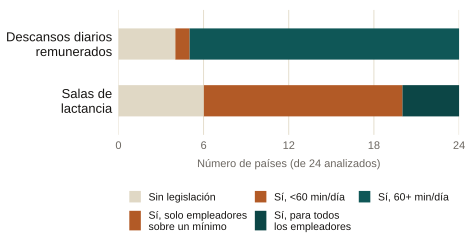

::: {.eyebrow}
Blog de Género y Diversidad del BID · Agosto de 2022
:::

::: {.finding}
Solo el 37% de los bebés en América Latina y el Caribe reciben lactancia
exclusiva a los seis meses, por debajo del promedio global de 44%. Las
políticas laborales que podrían extenderla, permisos remunerados y salas de
lactancia, existen en el papel en la mayoría de los países, pero se cumplen
de manera desigual y rara vez llegan a las trabajadoras informales.
:::

### Qué cubre el texto

Una de las razones más comunes para dejar la lactancia antes de tiempo es el
regreso al trabajo. Dos políticas laborales buscan ayudar: los descansos
diarios remunerados para amamantar o extraer leche, y las salas de
lactancia. Según una revisión de UNICEF sobre 24 países de la región, 19
ofrecen descansos de al menos 60 minutos al día, pero 4 no tienen ninguna
legislación al respecto. Las salas de lactancia están establecidas por ley
en 18 de los 24 países, pero en 14 de ellos solo se exigen a partir de un
número mínimo de empleados, lo que excluye del derecho a una parte
importante de las trabajadoras.

::: {.site-figure}

Políticas laborales de apoyo a la lactancia en 24 países de América Latina y
el Caribe revisados por UNICEF (2020). Fuente: blog del BID, con datos de
UNICEF.
:::

### Por qué importa

Dos brechas limitan cuánto ayudan estas políticas en la práctica. Primero,
el monitoreo es débil: hay poca información sistemática sobre si los
mandatos existentes se cumplen, así que ni trabajadoras ni empleadores
conocen con claridad sus derechos y obligaciones. Segundo, la mayor parte de
la fuerza laboral de la región trabaja en la informalidad, y un empleo
informal queda fuera de estos mandatos por definición. En América Latina y
el Caribe, en 2019 solo el 38.2% de las mujeres empleadas trabajaba de
manera formal, así que un derecho escrito en la ley laboral no llega a la
mayoría de las madres trabajadoras. Cerrar esa brecha requiere financiamiento
público, no solo regulación: proveer salas de lactancia tiene un costo para
los empleadores, y el apoyo del gobierno es lo que puede extender el
beneficio a las trabajadoras que un mandato financiado solo por el empleador
dejaría fuera.

::: {.paper-links}
- [Leer el texto en el BID](https://www.iadb.org/es/blog/genero-y-diversidad/lactancia-es-desarrollo-por-que-impulsar-la-lactancia-materna-en-el-trabajo)
- [English version](/policy/breastfeeding-workplace-policy/)
:::

Resumen completo

La Organización Mundial de la Salud recomienda la lactancia exclusiva
durante los primeros seis meses de vida, y de manera complementaria con
otros alimentos hasta los dos años o más. América Latina y el Caribe se
quedan cortos frente a ese estándar: solo el 37% de los bebés reciben
lactancia exclusiva a los seis meses, frente a 44% a nivel global. Una de
las razones más reportadas para dejar la lactancia antes de tiempo es la
necesidad de las madres de regresar al trabajo, lo que convierte a la
política laboral en una palanca central para cerrar esa brecha. Dos
políticas importan más: los descansos diarios remunerados para amamantar o
extraer leche, y las salas de lactancia dedicadas. Según una revisión de
UNICEF sobre el marco regulatorio de 24 países de la región, la mayoría ya
legisla alguna forma de ambas: 19 de 24 países ofrecen descansos de al menos
60 minutos al día, aunque 4 no tienen ninguna legislación al respecto, y
pocos países permiten que estos descansos se extiendan más allá de los seis
meses de edad del bebé. Las salas de lactancia están establecidas por ley en
18 de 24 países, pero en 14 de ellos solo se exigen a los empleadores que
superan un número mínimo de empleados, lo que excluye en la práctica a una
parte importante de las trabajadoras. Dos retos estructurales limitan el
alcance de estas políticas. Primero, el monitoreo y la evaluación de los
programas existentes es muy limitado en toda la región, dejando tanto a
trabajadoras como a empleadores con poca información clara sobre sus
derechos y obligaciones, y dejando a quienes hacen política pública con poca
evidencia sobre qué programas realmente funcionan. Segundo, la mayor parte
de la fuerza laboral de la región trabaja en la informalidad, y el empleo
informal queda fuera del alcance de cualquier mandato laboral por
definición; en América Latina y el Caribe, solo el 38.2% de las mujeres
empleadas trabajaba de manera formal en 2019. Debido a que las salas de
lactancia son costosas de proveer para los empleadores, y a que buena parte
de la fuerza laboral es informal, la acción gubernamental es central para
extender estos beneficios de manera equitativa: fortalecer los marcos
regulatorios hacia estándares internacionales como el Convenio 183 de la
OIT sobre protección de la maternidad, construir el monitoreo y la
evaluación que hoy falta, y establecer alianzas público-privadas, respaldadas
con financiamiento público, para que el apoyo a la lactancia llegue a las
trabajadoras que un mandato financiado únicamente por el empleador dejaría
fuera. Reconocer los desafíos que la maternidad plantea para las mujeres
trabajadoras, y los beneficios de la lactancia, debería ser parte de
cualquier política laboral con enfoque de género: apoyar la lactancia en el
trabajo no es solo un asunto de igualdad laboral, es una inversión en el
desarrollo de la siguiente generación.

