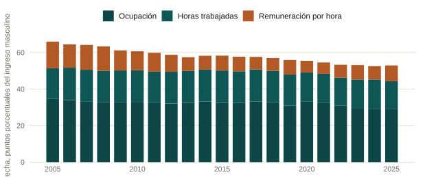
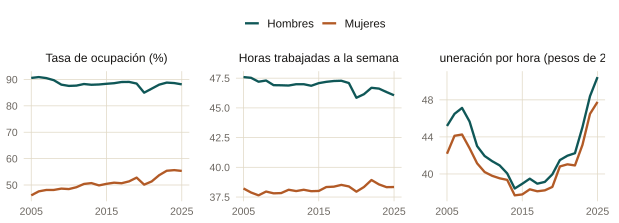

::: {.eyebrow}
Banco de México · Informe Trimestral Abril–Junio 2026, Recuadro 2 · Publicado el 26 de agosto de 2026
:::

Esta página resume, sin interpretación adicional, los hechos y cifras
presentados en el Recuadro 2 del Informe Trimestral Abril–Junio 2026 de
Banco de México. Es una publicación institucional, no firmada de manera
individual.

### Qué documenta el recuadro

El Recuadro descompone la brecha de género en ingresos laborales en México
durante el periodo 2005-2025 en tres componentes: la proporción de mujeres y
hombres con un empleo remunerado (ocupación), las horas trabajadas por
quienes están ocupados, y la remuneración que reciben por hora. La brecha se
calcula sobre toda la población en edad de trabajar, estén o no ocupadas.
Con base en esa descomposición, el Recuadro también analiza qué factores
estatales se asocian con la brecha de ocupación.

::: {.site-figure}

Descomposición de la brecha de género en ingresos laborales por componente,
2005-2025. Puntos porcentuales del ingreso laboral masculino. Fuente: Banco
de México con datos de INEGI.
:::

### Cifras principales

- La brecha de ingresos laborales totales fue de 53% en 2025: por cada peso
  que percibe un hombre en edad de trabajar, una mujer percibe 47 centavos.
- El componente de ocupación es el de mayor magnitud en todos los años,
  explicando alrededor de la mitad de la brecha total. Pasó de 35 puntos
  porcentuales en 2005 a 29 en 2025.
- El componente de horas trabajadas explica cerca de una cuarta parte de la
  brecha. Pasó de 17 puntos porcentuales en 2005 a 15 en 2025.
- El componente de remuneración por hora es el menor de los tres, aunque
  registró la mayor reducción relativa: de 15 puntos porcentuales en 2005 a
  9 en 2025.
- La brecha total se redujo de 66% del ingreso masculino en 2005 a 53% en 2025.
  De esa reducción de 13 puntos porcentuales, el componente de remuneración
  explicó 45% y el de ocupación 43%.
- A nivel estatal, una mayor proporción de la población en pareja o en
  hogares con menores de 13 años se asocia con una brecha de ocupación
  mayor. Un mayor PIB per cápita estatal y una mayor proporción de la
  población con educación media superior completa se asocian con una
  brecha de ocupación menor.

::: {.site-figure}

Tasa de ocupación, horas trabajadas a la semana y remuneración por hora, por
género, 2005-2025. Fuente: Banco de México con datos de INEGI.
:::

### Nota metodológica

El Recuadro señala que la descomposición es de naturaleza contable y no
identifica relaciones causales, y que los coeficientes del análisis estatal
documentan correlaciones condicionales entre la brecha de ocupación y sus
posibles determinantes, no relaciones causales.

::: {.paper-links}
- [Leer el recuadro completo (Banco de México)](https://www.banxico.org.mx/publicaciones-y-prensa/informes-trimestrales/recuadros/%7BF1730819-16B5-AAD5-B61D-420CD88F674C%7D.pdf)
- [Datos: descomposición de la brecha (Banco de México)](https://www.banxico.org.mx/TablasWeb/informes-trimestrales/abril-junio-2026/1643F582-8D9F-4CED-907A-9B59FEE1DCFC.html)
- [Datos: ocupación, horas y remuneración (Banco de México)](https://www.banxico.org.mx/TablasWeb/informes-trimestrales/abril-junio-2026/DFD653C4-B8C1-4519-9733-BE1BE97C8749.html)
- [English version](/policy/gender-earnings-gap-box/)
:::
