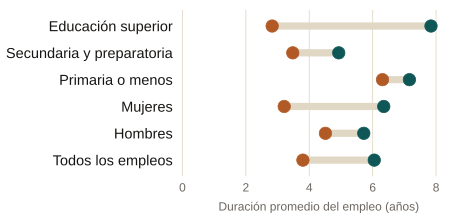

::: {.eyebrow}
Tesis de licenciatura · ITAM, 2017 · Premio Citibanamex de Economía 2017 · Premio Ex-ITAM 2018
:::

::: {.finding}
Los empleos informales en México duran menos que los formales en todos los
grupos analizados, pero la brecha no es pareja: crece marcadamente con el
nivel educativo y es más del doble entre mujeres que entre hombres.
:::

### Qué hace la tesis

Con datos de trayectorias laborales individuales de MOTRAL (2015), estimo
cuánto dura un empleo antes de terminar, comparando empleos formales e
informales mediante análisis de supervivencia: estimaciones Kaplan-Meier de
la función de supervivencia y modelos de riesgos proporcionales de Cox. El
objetivo es identificar qué características, género, edad, educación, y si el
primer empleo de una persona fue informal, están asociadas con salir más
rápido o permanecer más tiempo en un empleo informal.

::: {.site-figure}

Duración promedio estimada del empleo, en años, formal frente a informal.
Fuente: estimaciones propias con MOTRAL 2015.
:::

### Qué encuentra la tesis

Un empleo formal dura en promedio 6.1 años, frente a 3.8 años en la
informalidad. La brecha es mayor entre las mujeres, 49% menos duración en la
informalidad, que entre los hombres, 21% menos. También crece con la
escolaridad: entre quienes tienen educación superior, un empleo informal dura
64% menos que uno formal, frente a solo 12% entre quienes tienen primaria o
menos. Haber empezado la vida laboral en la informalidad también eleva el
riesgo de seguir en empleos informales más adelante, evidencia de que la
informalidad temprana deja huella.

### Por qué importa para política pública

La informalidad laboral cubre a poco más de la mitad de los ocupados en
México y limita el acceso a seguridad social, seguro médico y pensión.
Entender qué tan estable es un empleo informal, y para quién lo es menos,
ayuda a orientar mejor los programas de capacitación y de acceso temprano al
empleo formal, en particular para las personas con menor escolaridad y para
las mujeres, donde la brecha con la formalidad es más amplia.

::: {.paper-links}
- [Tesis (PDF)](../../../files/tesis-duracion-informalidad-laboral.pdf)
- [English version](/policy/thesis-informality-duration/)
:::

Resumen completo

La informalidad laboral cubre a poco más de la mitad de los empleos en México
y se ha mantenido relativamente estable durante décadas. Esta tesis estudia
cuánto duran los empleos informales y cómo se compara su duración con la del
empleo formal, mediante análisis de supervivencia sobre datos individuales de
trayectorias laborales de la ronda 2015 de MOTRAL. Los empleos formales duran
más que los informales en todos los grupos analizados, por género, estado
civil, edad y educación, y los empleos informales enfrentan además un riesgo
consistentemente mayor de terminar en cualquier momento. Un empleo formal dura
en promedio 6.1 años frente a 3.8 años uno informal; las medianas muestran un
patrón similar. La brecha entre la duración formal e informal no es uniforme.
Es mucho mayor entre las mujeres, cuyos empleos informales duran 49% menos
tiempo que los formales, que entre los hombres, con 21%. También crece
marcadamente con la educación: entre las personas con educación superior, los
empleos informales duran 64% menos que los formales, frente a una brecha de
12% entre quienes tienen primaria o menos, consistente con que el empleo
informal funcione más como un peldaño temporal para las personas con mayor
escolaridad. Haber entrado al mercado laboral a través de un primer empleo
informal eleva de manera independiente el riesgo de perder un empleo informal
posterior, lo que apunta a una persistencia de las trayectorias informales a
nivel individual. La tesis argumenta que la política dirigida a reducir la
informalidad debe considerar esta heterogeneidad: ampliar los programas de
capacitación laboral y facilitar la entrada temprana al empleo formal importa
más para las personas con menor escolaridad y para las mujeres, donde la
brecha de durabilidad entre el empleo formal y el informal es mayor.

