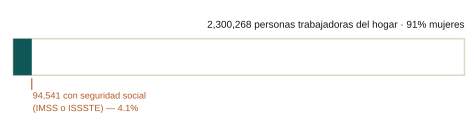

::: {.eyebrow}
En proceso
:::

La afiliación voluntaria es el primer paso estándar hacia un régimen obligatorio
para trabajadores difíciles de alcanzar. Este proyecto pregunta cuánto de la
brecha cierra en realidad.

::: {.chart-figure}
{.chart-img-light}
{.chart-img-dark}

Personas trabajadoras del hogar en México y proporción con seguridad social, 2026-T2. Cálculo propio con microdatos de la ENOE y su diseño muestral complejo; la cobertura es afiliación al IMSS o al ISSSTE.
:::

### Qué hace el proyecto

Las personas trabajadoras del hogar prestan servicios esenciales para los hogares
privados, y sin embargo rara vez tienen acceso a derechos y protecciones
laborales, con una de las tasas de informalidad más altas de la economía. En
México hay alrededor de 2.3 millones, con una segregación ocupacional marcada por
género: más del 90% son mujeres.

Estudio el cambio de 2019 en la Ley Federal del Trabajo que amplió el acceso a
prestaciones de seguridad social para este grupo. El IMSS ya había arrancado en
abril un programa piloto de incorporación voluntaria, y la reforma lo encaminó
hacia un régimen obligatorio. Uso la ENOE para rastrear su efecto sobre los
resultados laborales observados.

### Por qué importa para política pública

Obligar la cobertura cuando el patrón es un hogar plantea problemas de aplicación
que no aparecen dentro de las empresas. Si un piloto voluntario genera suficiente
adopción para hacer viable la obligatoriedad es la pregunta práctica que enfrenta
el IMSS, y la respuesta se traslada a otras ocupaciones con empleadores atomizados.

::: {.paper-links}
- [Borrador a solicitud](mailto:alain.pineda@banxico.org.mx)
- [English version](/research/in-progress/domestic-workers/)
:::
