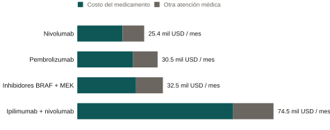
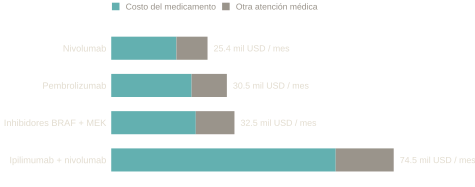

::: {.eyebrow}
Publicado · The Oncologist (2022)
:::

Con Mollie F. Qian, Nicolas J. Betancourt, Nolan J. Maloney, Kevin A. Nguyen,
Sunil A. Reddy, Evan T. Hall, Susan M. Swetter y Lisa C. Zaba.

Entre los cuatro esquemas de medicamentos usados como primer tratamiento para
melanoma avanzado en Estados Unidos entre 2016 y 2020, uno costó entre dos y
tres veces más por mes que los otros tres, y el medicamento en sí explicó la
mayor parte de la diferencia. El más barato, nivolumab solo, fue también el
más recetado.

::: {.chart-figure}
{.chart-img-light}
{.chart-img-dark}

Gasto total en atención médica por paciente por mes, según esquema de primera
línea, 2016–2020, en dólares de 2020. El costo del medicamento es el "costo
relacionado con el tratamiento" del artículo; la otra atención es el resto.
Fuente: Tabla 2 del artículo.
:::

### Qué hace el artículo

Desde 2011, medicamentos nuevos cambiaron cómo se trata el melanoma avanzado.
Las inmunoterapias, como nivolumab y pembrolizumab, entrenan al sistema
inmune para atacar el tumor, y pueden combinarse con ipilimumab, una
inmunoterapia anterior. Las terapias dirigidas, inhibidores de BRAF y de MEK
usados juntos, bloquean una mutación específica del tumor. La supervivencia
mejoró. Los costos subieron, y ningún estudio reciente había comparado
cuánto cuestan estos esquemas en la práctica.

El artículo usa registros de reclamaciones de Optum, una base nacional de
personas con seguro médico privado, para seguir a 2,018 adultos con melanoma
metastásico que empezaron uno de cuatro esquemas entre 2016 y 2020. Para
cada paciente mide, por mes de tratamiento, hospitalizaciones, visitas a
urgencias, consultas externas y gasto total en atención médica. Después
compara los esquemas con modelos de regresión que ajustan por edad, otras
enfermedades, metástasis cerebral, tipo de seguro y cuánta atención usaba
cada paciente antes de empezar el tratamiento. Yo trabajé en el análisis de
datos y en el manuscrito con el equipo clínico.

### Qué encontró

Nivolumab solo fue el esquema menos costoso, con cerca de 25 mil dólares por
paciente por mes en gasto total. Tras el ajuste, pembrolizumab solo costó
unos 6,500 dólares más por mes y la combinación dirigida unos 3,800 más. La
combinación de inmunoterapias costó unos 47,600 dólares más por mes que
nivolumab. Sus pacientes también tuvieron más días de hospital, más visitas a
urgencias y más consultas externas, lo que es consistente con los efectos
secundarios conocidos de ipilimumab. En todos los esquemas, los medicamentos
en sí explicaron las diferencias en costo total.

También cambió lo que se receta. Nivolumab rebasó a pembrolizumab en 2018, el
año en que el regulador aprobó aplicarlo cada cuatro semanas en vez de cada
dos. Menos infusiones son menos visitas y menos costo, lo que puede explicar
parte de la brecha entre dos medicamentos que, según los ensayos, funcionan
más o menos igual.

### Cómo leerlo

Es una comparación descriptiva construida con registros de aseguradoras. No
es un ensayo clínico. Los pacientes no se asignaron al azar a cada esquema:
a quienes tenían metástasis cerebral, por ejemplo, se les dio con más
frecuencia la combinación de inmunoterapias. Los modelos ajustan por eso y
por las demás características que los registros contienen, pero los
registros no traen el estado de mutación del tumor ni el detalle de la etapa,
así que quedan diferencias no observadas entre grupos. La muestra tiene
seguro privado, así que no representa a todo el país. El artículo reporta
dónde queda cada esquema en costo y uso de atención, dados los pacientes que
lo recibieron. No estima qué pasaría si un paciente cambiara de un esquema a
otro.

::: {.paper-links}
- [Documento (PDF)](../../../../files/melanoma-cost-utilization.pdf)
- [Versión publicada](https://academic.oup.com/oncolo/advance-article/doi/10.1093/oncolo/oyac219/6776043)
- [English version](/research/other/melanoma-utilization/)
:::
