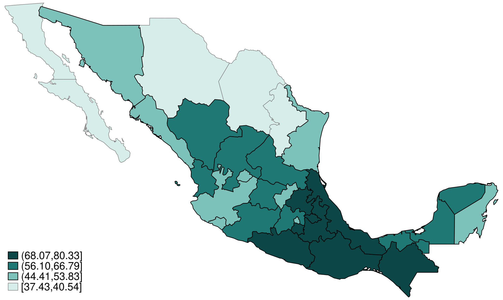
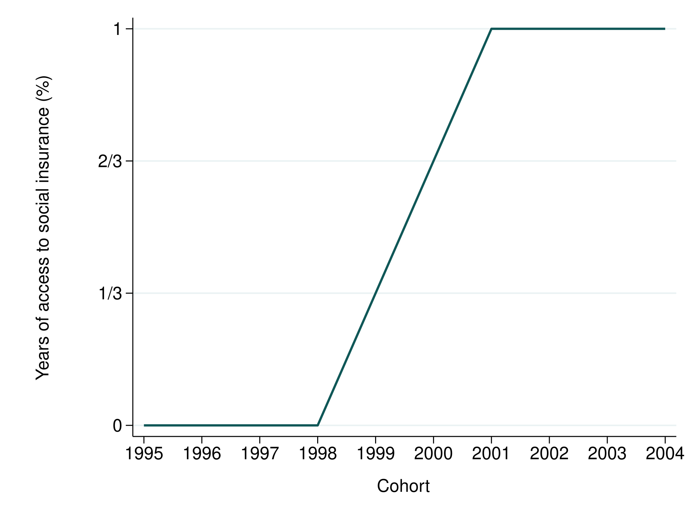

::: {.eyebrow}
Documento de trabajo · Borrador de agosto de 2026
:::

::: {.finding}
Desligar la cobertura médica de un contrato formal no empujó a los jóvenes hacia
la informalidad. Funcionó como rampa de entrada al empleo formal asalariado, y con
más fuerza en los estados donde la informalidad era más alta al inicio.
:::

### Qué hace el documento

En 2016 México asignó a más de seis millones de estudiantes de bachillerato y
educación superior un número de seguridad social permanente y los inscribió
individualmente a la cobertura médica del IMSS, un beneficio ligado a estar
inscrito en la escuela y no a tener un empleo formal. Estudio el componente de
bachillerato comparando cohortes de nacimiento que seguían en la escuela al
momento de la implementación con cohortes ligeramente mayores, dejando que el
contraste varíe con la tasa de informalidad estatal previa a la política. El
diseño recupera cómo escala la respuesta con la informalidad inicial, en lugar de
un promedio nacional.

::: {.figure-row}
::: {.site-figure}

Tasa de informalidad previa a la política, por estado.
:::

::: {.site-figure}

Años de exposición a la reforma, por cohorte de nacimiento.
:::
:::

### Por qué importa para política pública

Una objeción de siempre a los beneficios no contributivos es que subsidian la
informalidad al margen, porque reducen el valor relativo de un empleo formal. Aquí
aparece lo contrario, y el mecanismo es administrativo más que financiero: el
derecho ya existía y las escuelas ya tenían listados a sus estudiantes. Lo que
cambió en 2016 fue que la cobertura quedó adherida a cada estudiante como persona,
con el número de seguridad social que la contratación formal exige. Cómo se
entrega un beneficio puede importar más que si es contributivo o no.

::: {.paper-links}
- [Documento (PDF)](../../../../files/social-insurance-without-a-job.pdf)
- [English version](/research/working-papers/social-insurance-without-a-job/)
:::

Resumen completo

En 2016 México asignó a más de seis millones de estudiantes de bachillerato y
educación superior un número de seguridad social permanente y los registró
individualmente para la cobertura médica del IMSS, un beneficio ligado a la
inscripción escolar y no a un empleo formal. Una objeción de larga data a este
tipo de políticas es que los beneficios desligados del contrato formal reducen el
valor relativo de un empleo formal y subsidian la informalidad al margen. Estudio
el componente de bachillerato comparando cohortes de nacimiento que seguían en la
escuela al momento de la implementación con cohortes ligeramente mayores, dejando
que el contraste varíe con la tasa de informalidad previa de cada estado; el
diseño recupera cómo escala la respuesta con la informalidad inicial en lugar de
un promedio nacional. Donde la informalidad inicial era mayor, precisamente donde
la preocupación por el subsidio es más aguda, las cohortes expuestas se separaron
más de las cohortes contiguas no expuestas en empleo formal, y el empleo informal
cayó en lugar de subir. La respuesta se concentra por completo en el empleo
asalariado y está ausente en el trabajo por cuenta propia. Desligar el beneficio
no inclinó a los jóvenes hacia la informalidad. El derecho era previo a la reforma
y las escuelas llevaban mucho tiempo listando a sus estudiantes; lo que cambió en
2016 fue que la cobertura quedó adherida a cada estudiante como persona, con el
número de seguridad social que la contratación formal requiere, y se hizo visible.
Entregado de esa manera, un beneficio fuera del contrato formal funcionó como
rampa de entrada al empleo formal y no como sustituto de este.

