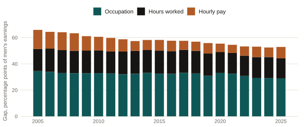
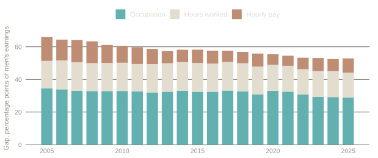
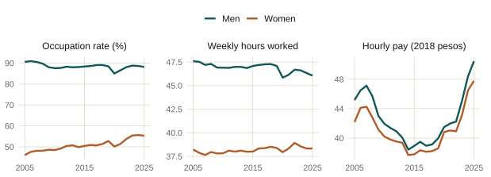
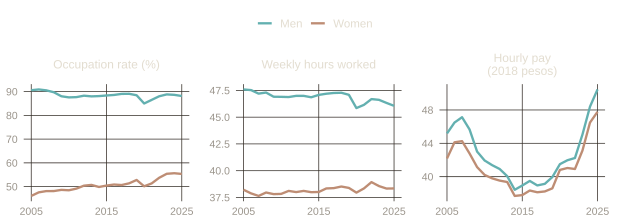

::: {.eyebrow}
Banco de México · Quarterly Report April–June 2026, Box 2 · Published August 26, 2026
:::

This page summarizes, without added interpretation, the facts and figures
presented in Box 2 of Banco de México's April–June 2026 Quarterly Report. It
is an institutional publication, not individually signed.

### What the box documents

The box decomposes Mexico's gender gap in labor earnings over 2005-2025 into
three components: the share of women and men who hold a paid job
(occupation), the hours worked by those who are employed, and the hourly pay
they receive. The gap is calculated over the entire working-age population,
whether employed or not. Building on that decomposition, the box also
examines which state-level factors are associated with the occupation gap.

::: {.chart-figure}
{.chart-img-light}
{.chart-img-dark}

Decomposition of the gender gap in labor earnings by component, 2005-2025.
Percentage points of men's labor earnings. Source: Banco de México with
INEGI data.
:::

### Key figures

- The total gender gap in labor earnings was 53% in 2025: for every peso a
  working-age man earns, a woman earns 47 cents.
- The occupation component is the largest of the three in every year,
  explaining about half of the total gap. It fell from 35 percentage points
  in 2005 to 29 in 2025.
- The hours-worked component explains about a quarter of the gap. It fell
  from 17 percentage points in 2005 to 15 in 2025.
- The hourly-pay component is the smallest of the three, though it recorded
  the largest relative decline: from 15 percentage points in 2005 to 9 in 2025.
- The total gap fell from 66% of men's earnings in 2005 to 53% in 2025. Of
  that 13-point decline, the pay component accounted for 45% and the
  occupation component for 43%.
- At the state level, a higher share of the population in a couple or in
  households with children under 13 is associated with a larger occupation
  gap. Higher state GDP per capita and a higher share of the population with
  completed upper-secondary education are associated with a smaller
  occupation gap.

::: {.chart-figure}
{.chart-img-light}
{.chart-img-dark}

Occupation rate, weekly hours worked, and hourly pay, by gender, 2005-2025.
Source: Banco de México with INEGI data.
:::

### Methodological note

The box notes that the decomposition is accounting in nature and does not
identify causal relationships, and that the state-level regression
coefficients document conditional correlations between the occupation gap
and its possible determinants, not causal effects.

::: {.paper-links}
- [Read the full box (Banco de México, in Spanish)](https://www.banxico.org.mx/publicaciones-y-prensa/informes-trimestrales/recuadros/%7BF1730819-16B5-AAD5-B61D-420CD88F674C%7D.pdf)
- [Data: gap decomposition (Banco de México)](https://www.banxico.org.mx/TablasWeb/informes-trimestrales/abril-junio-2026/1643F582-8D9F-4CED-907A-9B59FEE1DCFC.html)
- [Data: occupation, hours, and pay (Banco de México)](https://www.banxico.org.mx/TablasWeb/informes-trimestrales/abril-junio-2026/DFD653C4-B8C1-4519-9733-BE1BE97C8749.html)
- [Versión en español](/es/policy/gender-earnings-gap-box/)
:::
