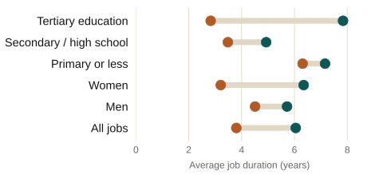

::: {.eyebrow}
Undergraduate thesis · ITAM, 2017 · Premio Citibanamex de Economía 2017 · Premio Ex-ITAM 2018
:::

::: {.finding}
Informal jobs in Mexico end sooner than formal ones in every group studied, but
the gap is far from uniform: it widens sharply with education and is more than
twice as large among women as among men.
:::

### What the thesis does

Using individual labor-history data from MOTRAL (2015), I estimate how long a
job lasts before it ends, comparing formal and informal employment with
survival analysis: Kaplan-Meier estimates of the survival function and Cox
proportional-hazards models. The goal is to see which characteristics, gender,
age, education, and whether someone's very first job was informal, are
associated with leaving an informal job faster or staying in it longer.

::: {.site-figure}

Average estimated job duration, in years, formal versus informal employment.
Source: author's estimates using MOTRAL 2015.
:::

### What the thesis finds

A formal job lasts 6.1 years on average, against 3.8 years in informal
employment. The gap is wider among women, 49% shorter in informal jobs, than
among men, 21% shorter. It also grows with schooling: among people with a
university education, an informal job lasts 64% less time than a formal one,
against only 12% among those with primary school or less. Having started
one's working life in an informal job also raises the risk of staying in
informal employment later on, evidence that early informality leaves a mark.

### Why it matters for policy

Informal employment covers just over half of Mexico's workforce and limits
access to social security, health coverage, and a pension. Understanding how
stable an informal job actually is, and for whom it is least stable, helps
target job-training programs and early routes into formal employment, in
particular for workers with less schooling and for women, where the gap with
formal employment is widest.

::: {.paper-links}
- [Thesis (PDF)](../../files/tesis-duracion-informalidad-laboral.pdf)
- [Versión en español](/es/policy/thesis-informality-duration/)
:::

Full summary

Informal employment covers just over half of all jobs in Mexico and has held
roughly steady for decades. This thesis studies how long informal jobs last
and how their duration compares with formal employment, using survival
analysis on individual labor-history data from the 2015 round of MOTRAL. Formal
jobs last longer than informal ones across every group examined, by gender,
marital status, age, and education, and informal jobs also face a
consistently higher hazard of ending at any point in time. A formal job lasts
6.1 years on average against 3.8 years for an informal one; median durations
show a similar pattern. The gap between formal and informal duration is not
uniform. It is much wider among women, whose informal jobs last 49% less time
than their formal ones, than among men, at 21%. It also grows sharply with
education: among workers with a university degree, informal jobs last 64%
less time than formal ones, compared with a 12% gap among workers with primary
school or less, consistent with informal work serving more as a stepping
stone for the more educated. Having entered the labor market through an
informal first job independently raises the hazard of losing a later informal
job, pointing to persistence in informal trajectories at the individual level.
The thesis argues that policy aimed at reducing informality should account for
this heterogeneity: expanding job-training programs and easing early entry
into formal employment matters most for workers with less schooling and for
women, where the durability gap between formal and informal work is largest.

