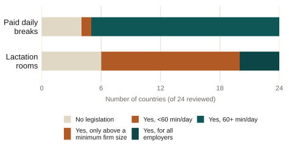
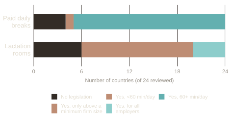

::: {.eyebrow}
IDB Gender and Diversity Blog · August 2022
:::

::: {.finding}
Only 37% of babies in Latin America and the Caribbean are exclusively
breastfed at six months, below the global average of 44%. The workplace
policies that could extend it, paid breastfeeding breaks and lactation rooms,
exist on paper in most countries but are inconsistently enforced and rarely
reach informal workers.
:::

### What the post covers

Returning to work is one of the main reasons mothers report stopping
breastfeeding early. Two workplace policies are meant to help: paid daily
breaks to breastfeed or express milk, and lactation rooms. Based on a UNICEF
review of 24 countries in the region, 19 offer breaks of at least 60 minutes
a day, but 4 have no legislation at all. Lactation rooms are mandated by law
in 18 of the 24 countries, but in 14 of those, only employers above a minimum
size are required to provide them, excluding a large share of working women
from the right entirely.

::: {.chart-figure}
{.chart-img-light}
{.chart-img-dark}

Workplace breastfeeding policies across 24 Latin American and Caribbean
countries reviewed by UNICEF (2020). Source: IDB blog, based on UNICEF data.
:::

### Why it matters

Two gaps limit how much these policies actually help. First, monitoring is
weak: there is little systematic data on whether existing mandates are
enforced, so neither workers nor employers reliably know their rights and
obligations. Second, most of the region's workforce is informal, and
informal jobs sit outside these mandates by definition. In Latin America and
the Caribbean, only 38.2% of employed women worked formally in 2019, so a
right written into labor law does not reach most working mothers. Closing
that gap requires public funding, not just regulation: providing lactation
rooms is costly for employers, and government support is what can extend the
benefit to workers a strictly employer-funded mandate would leave out.

::: {.paper-links}
- [Read the post at IDB (in Spanish)](https://www.iadb.org/es/blog/genero-y-diversidad/lactancia-es-desarrollo-por-que-impulsar-la-lactancia-materna-en-el-trabajo)
- [Versión en español](/es/research/health/breastfeeding-workplace-policy/)
:::

Full summary

The World Health Organization recommends exclusive breastfeeding for the
first six months of life, continued alongside other foods for up to two
years or more. Latin America and the Caribbean fall short of that standard:
only 37% of babies are exclusively breastfed at six months, against 44%
globally. One of the most common reasons mothers report stopping
breastfeeding early is the need to return to work, which makes workplace
policy a central lever for closing that gap. Two policies matter most: paid
daily breaks to breastfeed or express milk, and dedicated lactation rooms.
Based on a UNICEF review of the regulatory framework in 24 countries in the
region, most already legislate some form of both: 19 of 24 countries offer
breastfeeding breaks of at least 60 minutes a day, though 4 have no
legislation at all, and few countries let these breaks extend past a baby's
sixth month. Lactation rooms are mandated by law in 18 of 24 countries, but
in 14 of those, only employers above a minimum size threshold are required
to provide them, which excludes a substantial share of working women from
the right in practice. Two structural challenges limit how far these
policies reach. First, monitoring and evaluation of existing programs is
very limited across the region, leaving both workers and employers with
little clear information about their rights and obligations, and leaving
policymakers with little evidence about which programs actually work.
Second, most of the region's labor force works informally, and informal
employment sits outside the reach of any workplace mandate by definition; in
Latin America and the Caribbean, only 38.2% of employed women worked
formally as of 2019. Because lactation rooms are costly for employers to
provide, and because so much of the workforce is informal, government action
is central to extending these benefits equitably: strengthening regulatory
frameworks toward international standards such as ILO Convention 183 on
maternity protection, building the monitoring and evaluation that is
currently missing, and establishing public-private partnerships, backed by
public financing, so that breastfeeding support reaches workers a purely
employer-funded mandate would leave out. Recognizing the challenges
motherhood poses for working women, and the benefits of breastfeeding,
should be part of any labor policy with a gender lens: supporting
breastfeeding at work is not only a matter of workplace equality, it is an
investment in the next generation's development.

