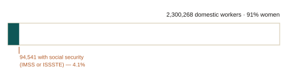
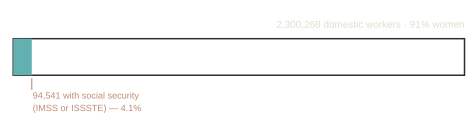

::: {.eyebrow}
Work in progress
:::

Voluntary enrollment is the standard first step toward a mandatory regime for
workers who are hard to reach. This project asks how much of the gap it actually
closes.

::: {.chart-figure}
{.chart-img-light}
{.chart-img-dark}

Domestic workers in Mexico and the share with social security, 2026-Q2. Own calculation from ENOE microdata using the survey's complex design; coverage is affiliation to IMSS or ISSSTE.
:::

### What the project does

Domestic workers provide essential services for private households, yet they
rarely have access to labor rights and protections and show one of the highest
informality rates in the economy. Mexico has roughly 2.3 million domestic
workers, with sharp occupational segregation by gender: more than 90% are women.

I study the 2019 change in Mexican federal labor law that extended access to
social insurance benefits to domestic workers. IMSS had launched a voluntary
enrollment pilot that April, and the reform set it on a path toward a mandatory
regime. I use the quarterly labor force survey to trace its effect on observed
labor outcomes.

### Why it matters for policy

Mandating coverage for workers whose employer is a household raises enforcement
problems that do not arise inside firms. Whether a voluntary pilot builds enough
take-up to make a mandate feasible is the practical question facing IMSS, and the
answer carries over to other occupations with atomized employers.

::: {.paper-links}
- [Draft available on request](mailto:alain.pineda@banxico.org.mx)
- [Versión en español](/es/research/in-progress/domestic-workers/)
:::
