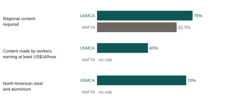
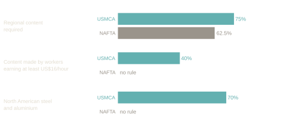

::: {.eyebrow}
Work in progress
:::

USMCA wrote labor standards directly into a trade agreement. This project measures
whether those provisions moved employment and pay, or only paperwork.

::: {.chart-figure}
{.chart-img-light}
{.chart-img-dark}

Automotive rules of origin, as written. Source: Congressional Research Service, *USMCA: Automotive Rules of Origin* (IF12082, December 2023), Table 1, based on NAFTA and USMCA text. The regional content shares apply to passenger vehicles, light trucks and core auto parts. The labor value content requirement is 40% for passenger vehicles and 45% for light trucks.
:::

### What the project does

The United States-Mexico-Canada Agreement replaced NAFTA in 2020, updating trade
rules for one of the world's largest free trade zones. Key changes include
stricter rules of origin, a labor value content requirement that ties tariff
preference to a share of each vehicle being built by workers earning at least
US$16 an hour, and a requirement for genuine worker representation in collective
bargaining in Mexico. I estimate the effect of these provisions on employment and
wages using administrative employer-employee matched data.

### Why it matters for policy

The labor chapter was one of the most contested parts of the renegotiation. U.S.
trade officials have presented it as a possible template for future trade deals.
Evidence on whether wage-linked content rules bind in practice is thin, and it
matters for how Mexico approaches the annual reviews that followed the July 2026
joint review.

::: {.paper-links}
- [Draft available on request](mailto:alain.pineda@banxico.org.mx)
:::
