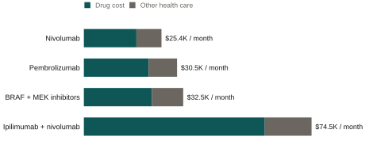
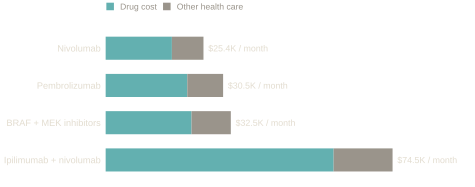

::: {.eyebrow}
Published · The Oncologist (2022)
:::

With Mollie F. Qian, Nicolas J. Betancourt, Nolan J. Maloney, Kevin A. Nguyen,
Sunil A. Reddy, Evan T. Hall, Susan M. Swetter, and Lisa C. Zaba.

Among the four drug regimens used as first treatment for advanced melanoma in
the United States between 2016 and 2020, one cost two to three times as much
per month as the other three, and the drug itself accounted for most of the
difference. The cheapest, nivolumab on its own, was also the most prescribed.

::: {.chart-figure}
{.chart-img-light}
{.chart-img-dark}

Total health care spending per patient per month, by first-line regimen,
2016–2020, in 2020 dollars. Drug cost is the paper's "treatment-related
cost"; other health care is the remainder. Source: Table 2 of the paper.
:::

### What the paper does

Since 2011, new drugs have changed how advanced melanoma is treated.
Immunotherapies such as nivolumab and pembrolizumab train the immune system
to attack the tumor, and can be combined with ipilimumab, an older
immunotherapy. Targeted therapies, BRAF and MEK inhibitors used together,
block a specific mutation in the tumor. Survival improved. Costs rose, and no
recent study had compared what these regimens cost in practice.

The paper uses insurance claims from Optum, a national database of people
with commercial coverage, to follow 2,018 adults with metastatic melanoma who
started one of four regimens between 2016 and 2020. For each patient it
measures, per month of treatment, hospital stays, emergency visits,
outpatient visits, and total health care spending. It then compares the
regimens with regression models that adjust for age, other illnesses, brain
metastases, type of insurance, and how much care each patient used before
starting treatment. I worked on the data analysis and the manuscript with
the clinical team.

### What it found

Nivolumab alone was the least costly regimen, at about $25,000 per patient
per month in total health care spending. After adjustment, pembrolizumab
alone cost about $6,500 more per month and the targeted combination about
$3,800 more. The immunotherapy combination cost about $47,600 more per month
than nivolumab. Its patients also had more hospital days, more emergency
visits, and more outpatient visits, which is consistent with the known side
effects of ipilimumab. Across regimens, the drugs themselves drove the
differences in total cost.

Prescribing also shifted. Nivolumab overtook pembrolizumab in 2018, the year
regulators approved giving it every four weeks instead of every two. Fewer
infusions mean fewer visits and lower costs, which may explain part of the
cost gap between two drugs that trials suggest work about equally well.

### How to read it

This is a descriptive comparison built from claims data. It is not a trial.
Patients were not assigned to regimens at random: those with brain
metastases, for instance, were more often given the immunotherapy
combination. The models adjust for that and for other characteristics the
data record, but claims do not record tumor mutation status or stage detail,
so unobserved differences between groups remain. The sample is commercially
insured, so it is not representative of the whole country. The paper reports
where each regimen sits on cost and use of care, given the patients who
received it. It does not estimate what would happen if a patient were moved
from one regimen to another.

::: {.paper-links}
- [Paper (PDF)](../../../files/melanoma-cost-utilization.pdf)
- [Published version](https://academic.oup.com/oncolo/advance-article/doi/10.1093/oncolo/oyac219/6776043)
- [Versión en español](/es/research/other/melanoma-utilization/)
:::
